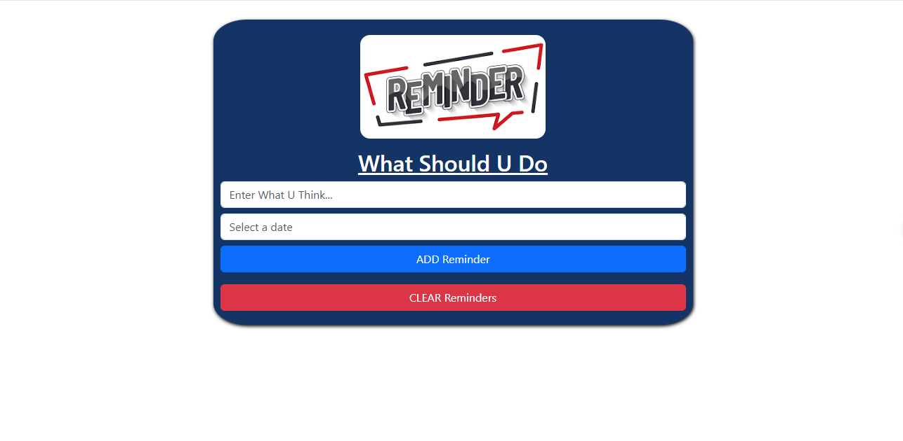

# reminder-app-react-old-redux[mapStateToProps, mapdispatchtoprops]-Class-component

This is a reminder application built with ReactJs [class-component]. it helps you to enter what you what to do and select the date. andd it has two buttons one to add reminder, 
and other one to clear them. just to learn and practice redux old style withe react class-component

in this project i tried to use new feature like [moment "A JavaScript date library", DateTime Picker library, sfcookies instead of local-storage, react-bootstrap]

## Table of contents

- [Overview](#overview)
- [Features](#Features)
- [Components](#Components)
     - [App](#App)
- [Installation](#Installation)
- [Usage](#Usage)
- [Links](#Links)
- [Screenshot](#Screenshot)
- [What I learned](#what-i-learned)
- [Continued development](#continued-development)
- [Author](#author)
- [Acknowledgments](#Acknowledgments)


## overview
This is a simple reminder application built with ReactJs [class-component]. it helps you to enter what you what to do and select the date.
andd it has two buttons one to add reminder, and other one to clear them. just to learn and practice redux old style withe react class-component.
in this project i tried to use new feature like [moment "A JavaScript date library", DateTime Picker library, sfcookies instead of local-storage, react-bootstrap]


## Features
- simple reminder that has two buttons one to add reminder, and other one to clear them.

## Components

### App

The main component that has a Home component that holds the Redux and it's main functions [mapStateToProps, mapdispatchtoprops].


## Installation
To get started with this project, follow these steps:

you can clone the project or download it as Zip file.
1. Clone the repository:
   ```bash
   git clone https://github.com/olahasan/reminder-app-react-old-redux-mapStateToProps-mapdispatchtoprops--Class-component

2. Navigate to the project directory:
   cd <project-directory>

3. Install the required dependencies:
   npm install   


## Usage
To run the application, use the following command:

npm start


## Links

If you want to open the link in a new tab, you can:

- Press **Ctrl** (or **Cmd** on Mac) while clicking the link.
- Right-click the link and select **Open link in new tab**.

Otherwise, all links will open in the same tab.


- Solution URL: [here](https://github.com/olahasan/reminder-app-react-old-redux-mapStateToProps-mapdispatchtoprops--Class-component)

- Live Site URL: [here](https://reminder-app-react-old-redux.surge.sh/)

 ## Screenshot
 



## what-i-learned
Through this project:
1. I learned in this simple project how to create react app and treat with calss component,
2. how to deal with redux old style [actions,Rducers,types]
3. how to deal with **moment "A JavaScript date library"**
4. how to deal with **DateTime Picker library**
5. how to deal with **sfcookies instead of local-storage**
6. how to deal with **react-bootstrap**
7. how to deploy it on surge

## Continued Development
In the future, I plan to:
- learn reactJs Hooks.
- learn redux toolkit with reactJs Hooks.

### Author

GitHub - @olahasan

### Acknowledgments

I would like to thank the **[unique coderz academy](https://www.youtube.com/@UniqueCoderzAcademy)** for providing this challenge and to the community for their support.

